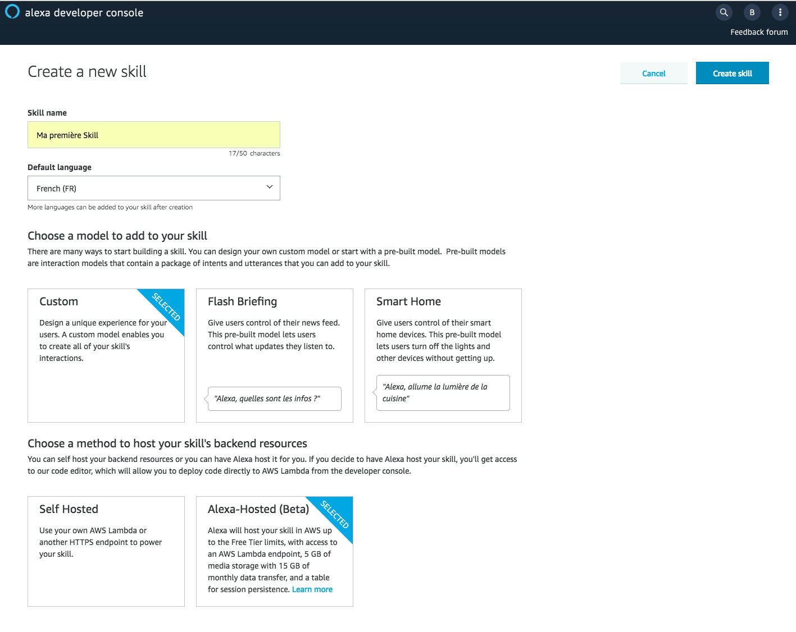

# Hello World Skill Creation

You will create and test your First Alexa Skill fully from the [Alexa Developer Console](https://developer.amazon.com/alexa/console/ask).

1. Navigate to the [Alexa Developer Console](https://developer.amazon.com/alexa/console/ask) 


2. Create a new Custom Skill with `Alexa-Hosted` for your backend resources



3. On the `Build` Tab of your Skill, click on `JSON Editor` and copy-paste [this interaction model](https://raw.githubusercontent.com/nachawat/skill-sample-nodejs-helloworld-fr/master/models/fr-FR.json)


4. Save your Interaction Model


>  **Important**: The developer console does not automatically save your work as you make changes. If you close the browser window without clicking Save Model, your work is lost.

5. Build your Interaction Model


> **Important**: You must successfully build the model before you can test it.

### Bravo ! You have just created your first Interaction Model. Now, you will create your Skill backend.

6. Navigate to `Code` Tab and copy-paste [this backend code](https://github.com/nachawat/skill-sample-nodejs-helloworld-fr/blob/master/lambda/custom/index.js)


7. Save your code


>  **Important**: The developer console does not automatically save your work as you make changes. If you close the browser window without clicking Save, your work is lost.

8. Deploy your code


> **Important**: You must successfully deploy the code before you can test it.

### Bravo ! You have just created your first Skill backend from the Alexa Developer Console using Alexa Skill Kit (ASK) SDKv2 for Node.js. Now, you will test your Skill backend.

9. Navigate to the `Test` Tab and enter the following utterance in the simulator ```ouvre mon atelier```


## Bravo ! You have just created and tested your First Alexa Skill using Hosted Skill.

